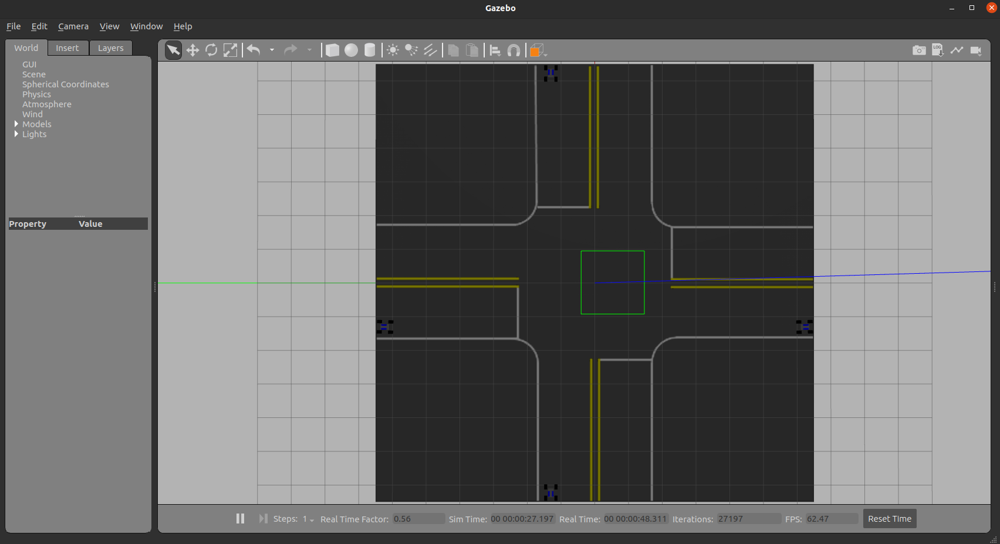

# Gazebo Simulator for AIMS
This is the simulator for the [Automated Intersection Management System (AIMS)](https://github.com/igeekoutz/AIMS-HIVE) project to run multiple vehicles in Gazebo.



## Install
### 1. Clone
Clone this repo to your `aims_ws/src` directory.
```sh
cd ~/aims_ws/src
git clone https://github.com/irisfield/aims_sim_gazebo.git
```

### 2. Packages
Install the `ros_control` packages.
```sh
sudo apt-get install ros-$ROS_DISTRO-ros-control ros-$ROS_DISTRO-ros-controllers
```

### 3. Build
Go to your `aims_ws` and build your packages.
```sh
cd ~/aims_ws
catkin_make
source devel/setup.sh
```

### 4. Intersection Model
Run the following script:
```sh
sh ~/aims_ws/src/aims_sim_gazebo/models/copy_model.sh
```

### 5. Testing
Launch the `aims.launch` file.
```sh
roslaunch ackermann_vehicle_gazebo aims.launch
```
